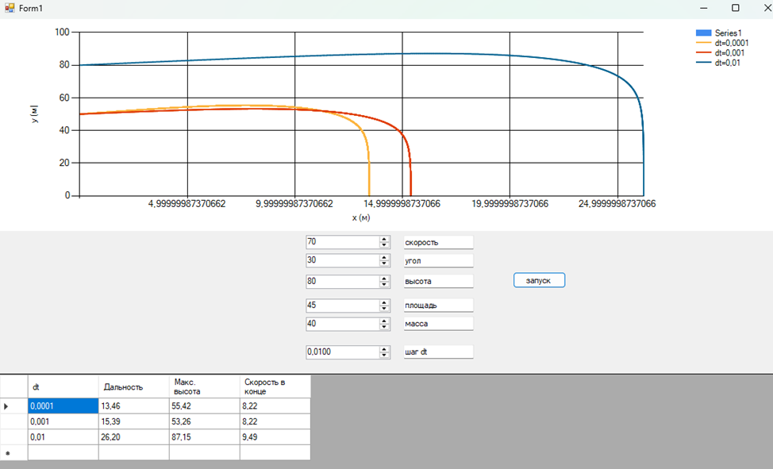

## Cкриншот

## Таблица
| Шаг моделирования, с | 1      | 0.1    | 0.01   | 0.001  | 0.0001 |
|-----------------------|--------|--------|--------|--------|--------|
| Дальность полёта, м   | 48,97  | 39,59  | 39,53  | 39,54  | 39,54  |
| Максимальная высота, м| 7,00   | 16,91  | 17,13  | 17,16  | 17,16  |
| Скорость в конечной точке, м/с | 1965,61 | 12,34 | 12,31 | 12,31 | 12,31 |

##	Вывод
В ходе выполнения лабораторной работы была разработана программа для моделирования полёта тела в атмосфере с учётом сопротивления воздуха. Для численного решения дифференциальных уравнений движения использовался метод Рунге–Кутты 4-го порядка.
В процессе моделирования были получены значения дальности полёта, максимальной высоты и скорости в конечной точке при различных шагах интегрирования. Анализ результатов показал, что при больших значениях шага моделирования (dt = 1 с) возникает значительная численная погрешность, что приводит к искажению результатов (существенное отклонение дальности и скорости).
При уменьшении шага интегрирования (dt ≤ 0,01 с) результаты стабилизируются и практически совпадают, что свидетельствует о сходимости численного метода и достаточной точности вычислений.
Таким образом, точность моделирования существенно зависит от выбранного шага интегрирования: чем меньше шаг, тем выше точность, однако увеличивается время вычислений. Метод Рунге–Кутты 4-го порядка обеспечивает высокую точность при сравнительно небольших значениях шага моделирования.
