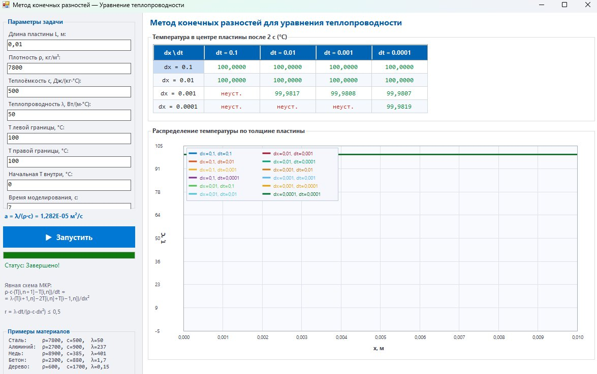

## Скриншот

## Таблица
| Шаг по времени, с \ Шаг по пространству, м | 0,1      | 0,01     | 0,001    | 0,0001   |
|---------------------------------------------|----------|----------|----------|----------|
| 0,1                                         | 100,0000 | 100,0000 | 100,0000 | 100,0000 |
| 0,01                                        | 100,0000 | 100,0000 | 100,0000 | 100,0000 |
| 0,001                                       | неуст.   | 99,9817  | 99,9808  | 99,9807  |
| 0,0001                                      | неуст.   | неуст.   | неуст.   | 99,9819  |

## Вывод
В ходе выполнения лабораторной работы была разработана программа для моделирования изменения температуры в пластине на основе одномерного уравнения теплопроводности с применением метода конечных разностей (явная схема). В качестве параметров материала использовались отдельные физические характеристики: плотность ρ, удельная теплоёмкость c и теплопроводность λ, из которых автоматически вычислялся коэффициент температуропроводности a = λ/(ρ·c).

В процессе моделирования была заполнена таблица значений температуры в центральной точке пластины после 2 секунд модельного времени при различных комбинациях шага по времени (dt) и шага по пространству (dx). Ряд комбинаций был отмечен как неустойчивые — это происходит при нарушении условия устойчивости явной схемы: r = λ·dt/(ρ·c·dx²) ≤ 0,5. При несоблюдении данного условия численное решение расходится и не имеет физического смысла.

Анализ устойчивых результатов показал, что при крупных шагах по пространству (dx = 0,1 и dx = 0,01) температура в центре пластины после 2 с достигает значений 100 °C, то есть центр пластины полностью прогревается до температуры границ. Это объясняется тем, что при малом коэффициенте температуропроводности (a = 1,282·10⁻⁵ м²/с для стали) и крупной сетке модель не разрешает реальный температурный градиент. При уменьшении шага по пространству (dx = 0,001 и dx = 0,0001) начинают проявляться значения, близкие к 99,98 °C, что свидетельствует о сходимости решения.

Таким образом, точность моделирования существенно зависит от выбора шагов по времени и пространству. Явная схема МКР накладывает жёсткое ограничение на соотношение шагов. При правильном выборе параметров метод обеспечивает физически корректное и сходящееся решение.
