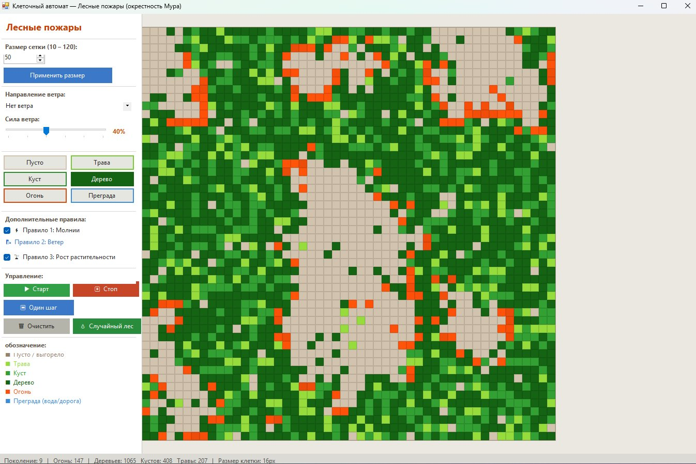

# Лабораторная работа: Клеточные автоматы. Лесные пожары (GUI)

## Скриншот

---

## Таблица состояний

| Состояние | Цвет | Вероятность возгорания |
|-----------|------|----------------------|
| Трава | Салатовый | 70% |
| Куст | Зелёный | 45% |
| Дерево | Тёмно-зелёный | 25% |
| Огонь | Оранжевый | — |
| Преграда | Голубой | 0% (блокирует огонь) |

---

## Дополнительные правила

**Правило 1 — Молнии.** Растение загорается самостоятельно с малой вероятностью `f` без горящих соседей. Трава: 0,015%, куст: 0,035%, дерево: 0,080%.

**Правило 2 — Ветер.** Задаётся направление (8 сторон) и сила (0–100%). Вероятность возгорания соседней клетки умножается на коэффициент `k = max(0.05, 1 + cos(α) × сила × 1.6)`, где `α` — угол между ветром и вектором к соседу.

**Правило 3 — Преграды.** Клетки-преграды (вода, дорога) не горят и полностью блокируют огонь. Рисуются вручную кистью.

---

## Вывод

В ходе работы реализован двумерный клеточный автомат с окрестностью Мура для моделирования лесных пожаров. Реализованы основные правила: выгорание, распространение огня, самовозгорание и рост растительности. Три дополнительных правила — молнии, ветер и преграды — существенно влияют на динамику: ветер вытягивает пожар в своём направлении, преграды локализуют очаг, а рост растительности обеспечивает цикличность поведения системы.
