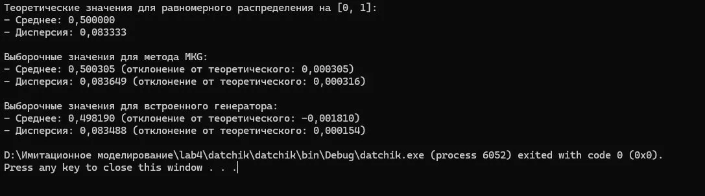

# Отчет по 4ой абораторной работе: Базовый датчик случайных чисел

**Размер выборки:** 100 000

## Результаты моделирования

1. **Реализованный базовый датчик (MKG):** Выборочное среднее: **0.500305** Выборочная дисперсия: **0.083649**

2. **Встроенный датчик языка (rnd.NextDouble()):** Выборочное среднее: **0.498190** Выборочная дисперсия: **0.083488**

3. **Теоретические характеристики:** Распределение: Равномерное в диапазоне [0; 1]. Математическое ожидание (теор. среднее): **0.5** Дисперсия (теор.): 1/12 ≈ **0.083333...**

## Скриншот результатов

## Вывод

Анализ результатов показал, что и реализованный вручную датчик (мультипликативный конгруэнтный генератор), и встроенный генератор языка C# работают корректно. На выборке в **100 000** чисел полученные значения выборочного среднего (около **0.5003** против теории **0.5**) и дисперсии (около **0.0836** против теории **0.0833**) практически полностью совпадают с теоретическими ожиданиями для равномерного распределения U[0, 1]. Небольшие отклонения представляют собой естественную статистическую погрешность, неизбежную при конечном объёме выборки.

**Итог:** Реализованный алгоритм MKG успешно проходит проверку на равномерность распределения и отсутствие систематических смещений, что подтверждает его пригодность для использования в качестве базового датчика в задачах стохастического моделирования. Встроенный генератор показал сопоставимую точность, что ожидаемо для нативной реализации языка.
