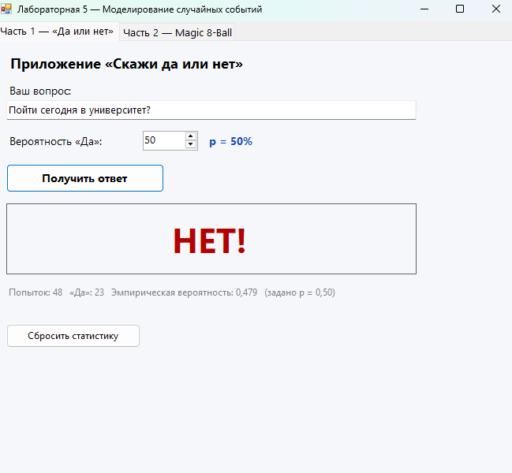
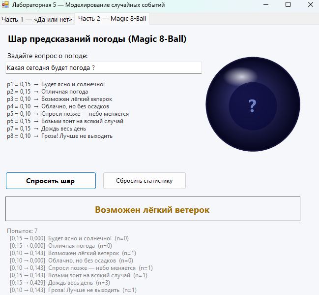

# Отчет по лабораторной работе №5
## Тема: Моделирование случайных событий (GUI)

### Цель работы
Разработка графического интерфейса (GUI) для моделирования случайных событий с заданными вероятностями.

---

### Часть 1: Приложение «Скажи да или нет»

В данной части работы было разработано приложение для симуляции бинарного случайного события (ответ «Да» или «Нет») с настраиваемой вероятностью.

**Функционал приложения:**
1.  **Ввод данных:** Пользователь может ввести произвольный вопрос (например, «Пойти сегодня в университет?»).
2.  **Настройка вероятности:** Реализован механизм установки вероятности положительного ответа («Да»). В примере установлена вероятность $p = 50\%$.
3.  **Генерация события:** При нажатии кнопки «Получить ответ» программа генерирует случайное число и сравнивает его с заданной вероятностью, выдавая результат («ДА» или «НЕТ»).
4.  **Статистика:** Приложение ведет подсчет общего количества попыток, количества ответов «Да» и вычисляет эмпирическую вероятность.
    *   *Пример из работы:* При 48 попытках выпало 23 раза «Да». Эмпирическая вероятность составила $0,479$ при заданной теоретической $p = 0,50$.

---

### Часть 2: Приложение «Шар предсказаний» (Magic 8-Ball)

Вторая часть работы посвящена созданию симулятора прогноза погоды, использующего модель взвешенных случайных событий.

**Логика работы:**
Приложение выбирает один из 8 возможных вариантов погоды. Каждый вариант имеет свой вес (вероятность выпадения):

*   $p_1 = 0,15$ — Будет ясно и солнечно!
*   $p_2 = 0,15$ — Отличная погода
*   $p_3 = 0,10$ — Возможен лёгкий ветерок
*   $p_4 = 0,10$ — Облачно, но без осадков
*   $p_5 = 0,10$ — Спроси позже — небо меняется
*   $p_6 = 0,15$ — Возьми зонт на всякий случай
*   $p_7 = 0,15$ — Дождь весь день
*   $p_8 = 0,10$ — Гроза! Лучше не выходить

**Интерфейс и результаты:**
*   Пользователь вводит вопрос о погоде.
*   Визуализация реализована в виде классического шара Magic 8-Ball.
*   Результат отображается крупным текстом (например, «Возможен лёгкий ветерок»).
*   **Статистика:** В нижней части окна отображается подробная статистика по каждому типу события, включая диапазон вероятностей $[p_{min} - p_{max}]$, текст ответа и количество выпадений ($n$).

---

### Заключение
В ходе выполнения лабораторной работы были созданы два приложения, демонстрирующие принципы генерации псевдослучайных чисел и работы с вероятностными распределениями в среде с графическим интерфейсом. Реализован сбор и отображение статистических данных для проверки соответствия эмпирических результатов теоретическим вероятностям.