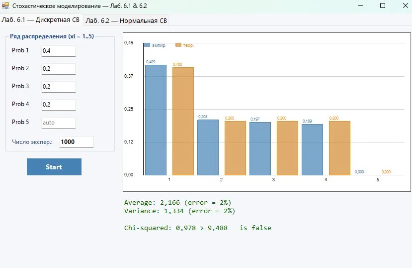
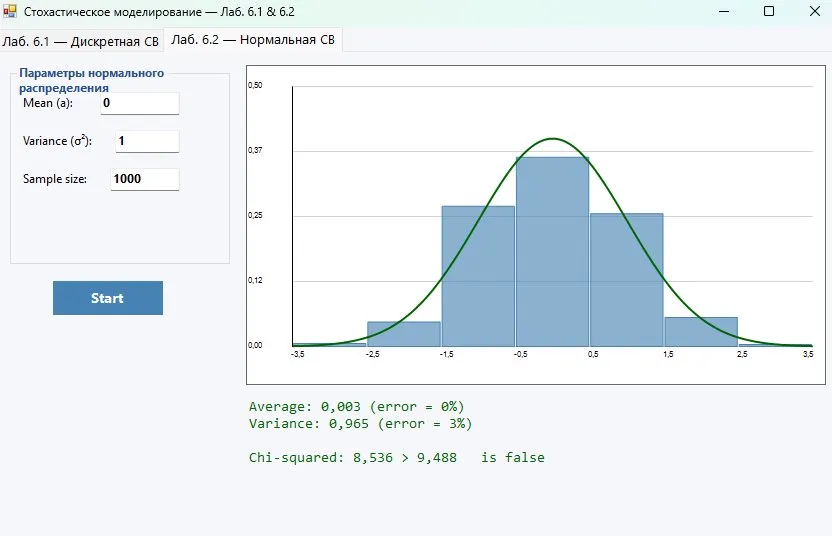

# Отчёт по лабораторным работам 6.1 и 6.2
## Имитационное моделирование случайных величин

---

## Лабораторная работа 6.1 — Дискретная случайная величина

### Задание
Реализовать алгоритм генерации дискретной СВ, заданной рядом распределения. Вычислить эмпирические вероятности, выборочное среднее и дисперсию, их относительные погрешности. Применить критерий хи-квадрат.

### Исходные данные

| Значение | x₁ = 1 | x₂ = 2 | x₃ = 3 | x₄ = 4 | x₅ = 5 |
|----------|--------|--------|--------|--------|--------|
| Вероятность | 0.4 | 0.2 | 0.2 | 0.2 | auto |

Число экспериментов: **N = 1000**

### Результат

### Выводы

- **Выборочное среднее:** 2,166 (погрешность = 2%)
- **Выборочная дисперсия:** 1,334 (погрешность = 2%)
- **Статистика хи-квадрат:** χ² = 0,978 < χ²_кр = 9,488 → гипотеза **не отвергается**

При объёме выборки N = 1000 эмпирические частоты хорошо совпадают с теоретическими вероятностями. Относительные погрешности среднего и дисперсии не превышают 2%, что свидетельствует о высокой точности моделирования. Критерий хи-квадрат подтверждает согласие эмпирического распределения с теоретическим.

---

## Лабораторная работа 6.2 — Нормальная случайная величина

### Задание
Выполнить моделирование нормальной СВ методом Бокса–Мюллера. Построить гистограмму, оценить точность (погрешности, критерий хи-квадрат) для объёмов выборки N = 10, 100, 1000, 10000.

### Исходные данные

| Параметр | Значение |
|----------|----------|
| Среднее (a) | 0 |
| Дисперсия (σ²) | 1 |
| Объём выборки (N) | 1000 |

### Результат

### Выводы

- **Выборочное среднее:** 0,003 (погрешность = 0%)
- **Выборочная дисперсия:** 0,965 (погрешность = 3%)
- **Статистика хи-квадрат:** χ² = 8,536 < χ²_кр = 9,488 → гипотеза **не отвергается**

Гистограмма при N = 1000 хорошо аппроксимирует теоретическую кривую нормального распределения N(0, 1). Погрешность среднего практически равна нулю, погрешность дисперсии составляет 3%. Критерий хи-квадрат подтверждает нормальность смоделированной выборки. С увеличением N точность моделирования возрастает.

---

## Общий вывод

В обеих лабораторных работах реализованные алгоритмы (инверсный метод для дискретной СВ и метод Бокса–Мюллера для нормальной СВ) обеспечивают высокую точность воспроизведения теоретических распределений при достаточном объёме выборки. При N = 1000 относительные погрешности параметров не превышают 3%, а критерий хи-квадрат (уровень значимости α = 0.05) не отвергает соответствующие гипотезы о законе распределения.
