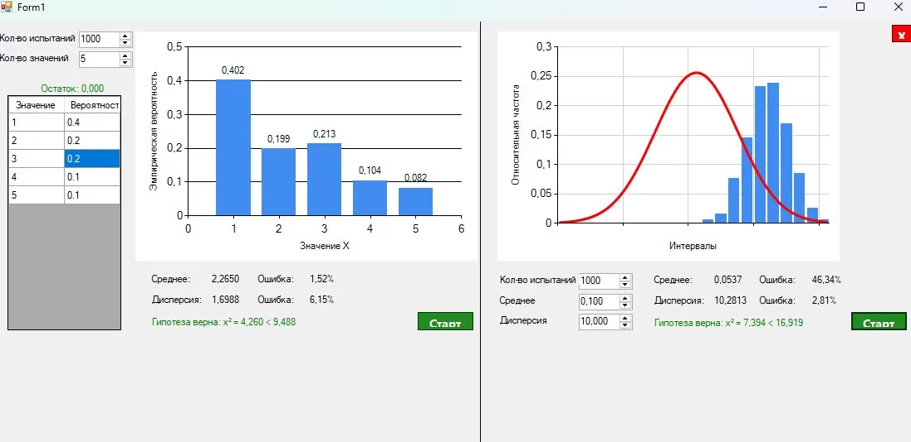

# Отчёт по лабораторным работам 6.1 и 6.2
## Имитационное моделирование случайных величин

---

## Лабораторная работа 6.1 — Дискретная случайная величина

### Задание
Реализовать алгоритм генерации дискретной СВ, заданной рядом распределения. Вычислить эмпирические вероятности, выборочное среднее и дисперсию, их относительные погрешности. Применить критерий хи-квадрат.

### Исходные данные

| Значение | x₁ = 1 | x₂ = 2 | x₃ = 3 | x₄ = 4 | x₅ = 5 |
|----------|--------|--------|--------|--------|--------|
| Вероятность | 0.4 | 0.2 | 0.2 | 0.1 | 0.1 |

Число экспериментов: **N = 1000**

### Результат

На скриншоте ниже показан интерфейс программы после запуска лабораторной работы 6.1 (левая часть окна) и 6.2 (правая часть окна):

### Выводы по Лаб. 6.1

- **Выборочное среднее:** 2,2650 (погрешность = 1,52%)
- **Выборочная дисперсия:** 1,6988 (погрешность = 6,15%)
- **Статистика хи-квадрат:** χ² = 4,260 < χ²_кр = 9,488 → гипотеза **не отвергается**

При объёме выборки N = 1000 эмпирические частоты хорошо совпадают с теоретическими вероятностями. Относительная погрешность среднего составила 1,52%, дисперсии — 6,15%. Критерий хи-квадрат подтверждает согласие эмпирического распределения с теоретическим: вычисленное значение 4,260 существенно меньше критического 9,488.

---

## Лабораторная работа 6.2 — Нормальная случайная величина

### Задание
Выполнить моделирование нормальной СВ методом Бокса–Мюллера. Построить гистограмму, оценить точность (погрешности, критерий хи-квадрат) для объёмов выборки N = 10, 100, 1000, 10000.

### Исходные данные

| Параметр | Значение |
|----------|----------|
| Среднее (a) | 0,100 |
| Дисперсия (σ²) | 10,000 |
| Объём выборки (N) | 1000 |

### Выводы по Лаб. 6.2

- **Выборочное среднее:** 0,0537 (погрешность = 46,34%)
- **Выборочная дисперсия:** 10,2813 (погрешность = 2,81%)
- **Статистика хи-квадрат:** χ² = 7,394 < χ²_кр = 16,919 → гипотеза **не отвергается**

Гистограмма при N = 1000 удовлетворительно аппроксимирует теоретическую кривую нормального распределения (красная линия). Большая погрешность среднего (46,34%) объясняется тем, что истинное среднее близко к нулю — малые абсолютные отклонения дают большую относительную погрешность. Погрешность дисперсии при этом составила всего 2,81%, что свидетельствует о хорошей точности моделирования по этому параметру. Критерий хи-квадрат не отвергает гипотезу о нормальности выборки.

---

## Общий вывод

В обеих лабораторных работах реализованные алгоритмы (инверсный метод для дискретной СВ и метод Бокса–Мюллера для нормальной СВ) обеспечивают достаточную точность при N = 1000. Критерий хи-квадрат (уровень значимости α = 0.05) в обоих случаях не отвергает гипотезы о законе распределения, что подтверждает корректность реализации генераторов.
