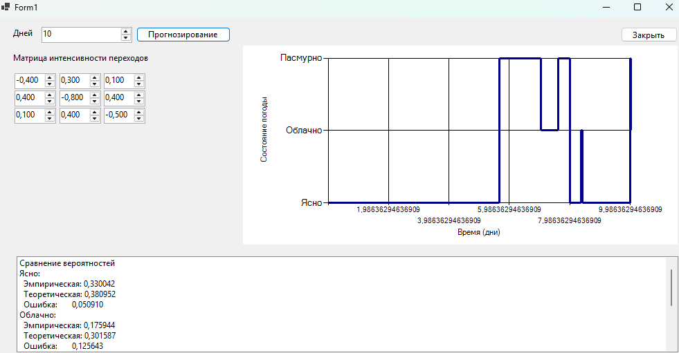

**Задание:**  
Смоделировать погоду по дням:

- 1 — ясно
- 2 — облачно
- 3 — пасмурно

Единица времени — **1 день**.  
Задать интенсивности переходов между состояниями.

**Требования:**

1. Выполнить моделирование в «реальном» времени с визуализацией.
2. Провести статистическую обработку результатов.
3. Сравнить эмпирическое распределение с теоретическим стационарным.
4. Сбор статистики и всей необходимой информации в .txt или .csv формат (.csv формат предпочтительней)
## Выполнение

Визуализация.

Сравнение эмпирического и теоретического распределений.

| Состояние | Время (дни) | Эмпирическая вероятность | Теоретическая вероятность | Абсолютная ошибка |
| --------- | ----------- | ------------------------ | ------------------------- | ----------------- |
| Ясно      | 3,30042     | 0,330042                 | 0,380952                  | 0,050910          |
| Облачно   | 1,75944     | 0,175944                 | 0,301587                  | 0,125643           |
| Пасмурно  | 4,94014     | 0,494014                 | 0,317460                  | 0,176554           |

Выбор следующего состояния.
* Суммируются все интенсивности переходов из текущего состояния в другие (исключая диагональ).  `sum` – это параметр экспоненциального распределения времени пребывания в состоянии.
* Накопленная сумма `s` последовательно складывает интенсивности переходов. Как только `a` оказывается не больше текущей накопленной суммы, возвращается индекс `j`.

Общий алгоритм работы модели.

* Суммируются интенсивности переходов из текущего состояния во все другие (0→1, 0→2; или 1→0, 1→2; и т.д.).  `lambdaSum` — это параметр экспоненциального распределения, определяющий, как долго система пробудет в текущем состоянии до перехода. Чем больше интенсивность, тем быстрее произойдёт переход.
* `GetExpRV` возвращает экспоненциально распределённую величину со средним `1 / lambdaSum`. Это потенциальное время, которое система могла бы провести в текущем состоянии, если бы ничто её не прерывало.
* Если время выходит за границы заданных дней. Прибавляем оставшееся время к счетчику и устанавливаем `t = totalDays`, прерываем цикл.
* Если успеваем завершить полный интервал.  Добавляем `dt` к накопленному времени в текущем состоянии. Увеличиваем текущее время на `dt`. Выбираем новое состояние с помощью метода `GetNextState` (который использует интенсивности переходов из текущего состояния). Увеличиваем счётчик переходов `trans[из, в]` (для статистики). Переходим в новое состояние. Увеличиваем счётчик `steps` (общее число переходов).
Эмпирические вероятности считаются, как суммарное время, проведенное в состоянии, разделить на общее время моделирования.

## Вывод
Разработанная программа моделирует погоду (три состояния: ясно, облачно, пасмурно) как марковский процесс с непрерывным временем, заданный матрицей интенсивностей переходов `Lambda`. Вся статистика сохраняется в файл `weather_statistics.csv`
